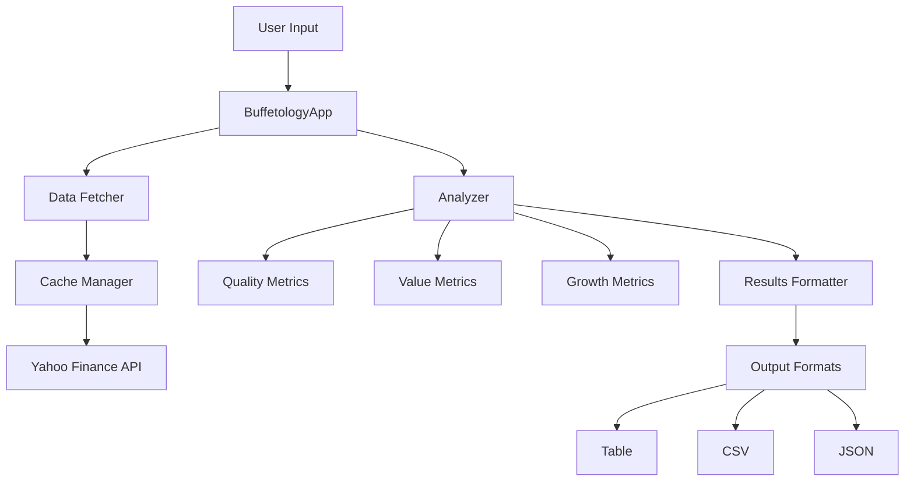
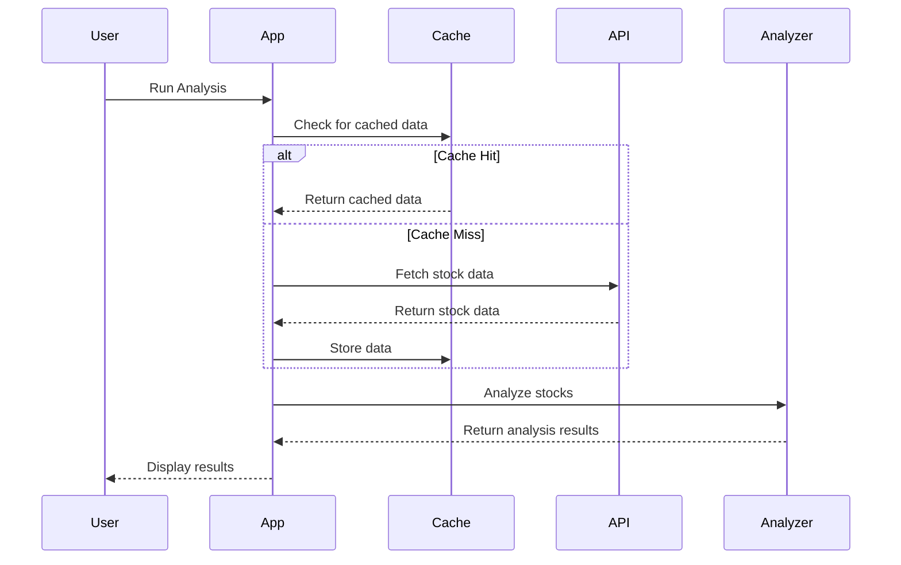
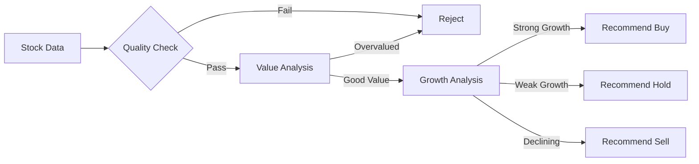

# Buffetology App

A stock analysis tool based on Warren Buffett's investment principles. The app analyzes stocks using quality, value, and growth metrics to provide investment recommendations.

## Features

- Analysis of S&P 500 stocks using Buffett's principles
- Quality metrics: debt levels, current ratio, profitability
- Value metrics: P/E, P/B, PEG ratios
- Growth metrics: revenue and earnings growth
- Caching system for efficient data retrieval
- Configurable analysis parameters
- Multiple output formats (table, CSV, JSON)

## Project Architecture



## Data Flow



## Analysis Process



## Installation

1. Clone the repository:
```bash
git clone https://github.com/yourusername/buffetology_app.git
cd buffetology_app
```

2. Create a virtual environment (recommended):
```bash
python -m venv buffetology
source venv/bin/activate  # On Windows: venv\Scripts\activate
```
Or in conda:
```bash
conda create -n buffetology python=3.10
conda activate buffetology
```

3. Install dependencies:
```bash
pip install -r requirements.txt
```

4. Install the package in development mode:
```bash
pip install -e .
```

## Usage

1. Basic usage (analyzes S&P 500 stocks):
```bash
python buffetology/app.py
```

2. Analyze specific tickers:
```bash
python buffetology/app.py AAPL MSFT GOOGL
```

3. Configure analysis parameters:
Edit `buffetology/config/config.yaml` to adjust:
- Analysis thresholds
- Number of stocks to analyze
- Output format
- Cache settings

## Configuration

The app uses a YAML configuration file (`config.yaml`) with the following main sections:

- `data_provider`: Configure data sources (Yahoo Finance, FMP, Financial Times)
- `analysis`: Set thresholds for quality, value, and growth metrics
- `cache`: Configure caching behavior
- `output`: Set output format and sorting preferences

## Project Structure

```
buffetology_app/
├── buffetology/
│   ├── app.py                 # Main application
│   │   └── app.py
│   ├── config/
│   │   ├── config.yaml        # Configuration file
│   │   └── config_loader.py   # Configuration loader
│   ├── data_fetchers/
│   │   ├── base_fetcher.py    # Base data fetcher
│   │   └── yahoo_fetcher.py   # Yahoo Finance fetcher
│   ├── analysis/
│   │   └── buffetology_analyzer.py  # Analysis logic
│   ├── cache/
│   │   └── cache_manager.py   # Cache management
│   └── tests/                 # Test files
├── requirements.txt           # Project dependencies
└── README.md                 # This file
```

## Contributing

1. Fork the repository
2. Create a feature branch
3. Commit your changes
4. Push to the branch
5. Create a Pull Request

## License

This project is licensed under the MIT License - see the LICENSE file for details.

## Acknowledgments

- Inspired by Mary Buffett's "Buffetology" book
- Uses various financial data providers
- Built with Python and modern software engineering practices 